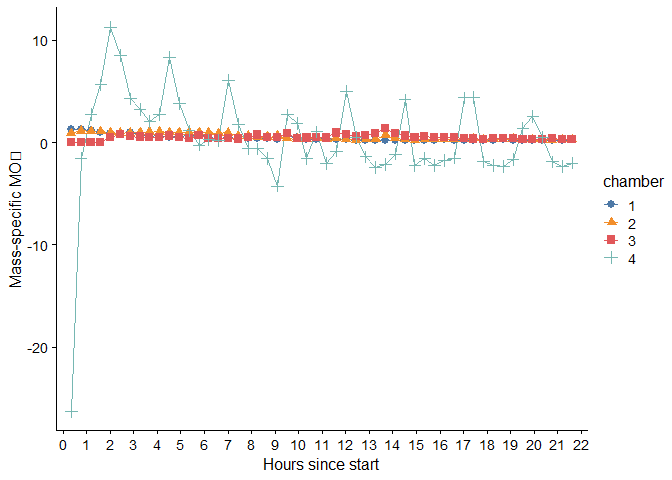
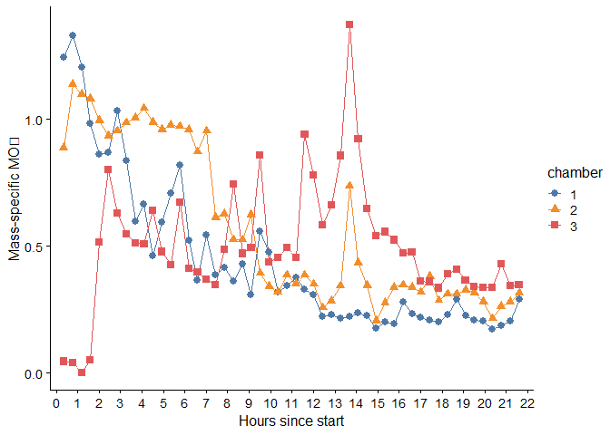

<!-- README.md is generated from README.Rmd. Please edit that file -->

# flatheadresp

<!-- badges: start -->
<!-- badges: end -->

The goal of flatheadresp is to streamline working with respirometry data
that is produced from the AquaResp software (i.e., used in the IMAS
Taroona Aquaculture Facility lab for flathead metabolic rate
experiments), including importing AquaResp metadata and experimental
data files into R, correcting mass-specific MO2 for post-experiment body
mass measurements or other fixes, and calculating MO_2 from the linear
regression slope of raw O2 data and correlation of O_2 ~ time.

AquaResp provide mass-specific oxygen consumption (MO_2) estimates for
animals from oxygen concentration in each experimental chamber during
the sealed measurement portion of each flush-wait-measure cycle. MO_2 is
provided in units of mg O₂/kg/hr (milligrams of oxygen per kilogram of
fish bodyweight per hour). MO_2 are calculated from the slope of a
regression line fit to (declining) oxygen concentration within the
sealed chamber over time. Oxygen concentration is sampled from the probe
in the experimental chamber every second. As is standard for
respirometry work, MO_2 estimates are quality controlled with the
coefficients of determination (R^2) calculated with Pearson’s
correlation, with MO_2 values of R^2 \>= 0.95 considered precise enough.
However, there is a bug in AquaResp where occasionally, an O_2
concentration measurement is missed and recorded as a 0 instead of NA,
and then this causes an erroneously low R^2 (and presumably a slightly
low slope and MO_2 estimate as well). This allows calculating accurate
R^2 to overcome the bug in the AquaResp v3.0 version where any missing
O_2 values resulted in erroneous R^2 values for MO2 measurements. \##
Installation

You can install the development version of flatheadresp from
[GitHub](https://github.com/) with:

``` r
# install.packages("pak")
pak::pak("bwwolfe/flatheadresp")
```

## Example

``` r
library(flatheadresp)
library(tidyr)
library(ggplot2)
#> Warning: package 'ggplot2' was built under R version 4.5.1
library(cowplot)
library(ggthemes)
#> 
#> Attaching package: 'ggthemes'
#> The following object is masked from 'package:cowplot':
#> 
#>     theme_map
```

## Load Example Data

The package ships an example AquaResp experiment under
`inst/extdata/aquaresp_experiment` that is used in the examples in the
documentation. Use `system.file()` to locate it:

``` r
exp_dir_path <- system.file("extdata", "aquaresp_experiment",
                            package = "flatheadresp")
exp_dir_path
#> [1] "C:/Users/bwolfe/AppData/Local/Temp/Rtmpawqogq/temp_libpath710437d16e3d/flatheadresp/extdata/aquaresp_experiment"
```

The experiment directory is structured in the standard format used by
AquaResp and this structure and file naming convention will be expected
by the functions in this package:

``` r
list.files(exp_dir_path)
#>  [1] "All slopes"                  "Experimental information"   
#>  [3] "notes.txt"                   "Oxygen data raw"            
#>  [5] "Summary data ABS resp 1.txt" "Summary data ABS resp 2.txt"
#>  [7] "Summary data ABS resp 3.txt" "Summary data ABS resp 4.txt"
#>  [9] "Summary data resp 1.txt"     "Summary data resp 2.txt"    
#> [11] "Summary data resp 3.txt"     "Summary data resp 4.txt"
```

The good news is you only need to provide the experiment’s file path and
the package’s functions will extract the needed files.

## Experimental Metadata and MO₂

Retrieve metadata for all chambers:

``` r
get_exp_metadata(exp_dir_path)
#>   chamber Experiment.start..UNIX.time Flush.time..s Wait.time..s
#> 1       1                  1745641134           240           60
#> 2       2                  1745641134           240           60
#> 3       3                  1745641134           240           60
#> 4       4                  1745641134           240           60
#>   Measurement.time..s Mass.of.fish..kg Volume.respirometer..L
#> 1                1200            0.123                   3.35
#> 2                1200            0.058                   3.35
#> 3                1200            0.127                   3.35
#> 4                1200            0.001                   3.35
#>   Real.volume..vresp...vfish...neutrally.bouyant...L Salinity Temperature
#> 1                                              3.227     35.5        15.6
#> 2                                              3.292     35.5        15.6
#> 3                                              3.223     35.5        15.6
#> 4                                              3.349     35.5        15.6
#>   Oxygen.solubilty..mg.O2...L           exp_start
#> 1                      8.0623 2025-04-26 14:18:54
#> 2                      8.0623 2025-04-26 14:18:54
#> 3                      8.0623 2025-04-26 14:18:54
#> 4                      8.0623 2025-04-26 14:18:54
```

Get AquaResp-calculated MO₂s for a given chamber:

``` r
chamber2_mo2s <- get_exp_MO2s(exp_dir_path, chamber = 2)
head(chamber2_mo2s)
#>   chamber cycle          Clock.TIME TIME.HOURS  TIME.UNIX       MO2
#> 1       2     1 2025-04-26 16:02:07  0.3502778 1745648526  88.72929
#> 2       2     2 2025-04-26 16:27:07  0.7669444 1745650026 113.65878
#> 3       2     3 2025-04-26 16:52:07  1.1836111 1745651526 109.80107
#> 4       2     4 2025-04-26 17:17:07  1.6002778 1745653026 108.06524
#> 5       2     5 2025-04-26 17:42:07  2.0169444 1745654527  99.44971
#> 6       2     6 2025-04-26 18:07:07  2.4336111 1745656027  93.45417
#>          SLOPE Intercept  Pearson.R       R.2             P      Std.Err
#> 1 -0.005386100  101.8832 -0.9956077 0.9912346  0.000000e+00 1.463943e-05
#> 2 -0.006899386  103.9502 -0.6513065 0.4242002 1.177663e-145 2.323345e-04
#> 3 -0.006665212  102.9401 -0.9991329 0.9982665  0.000000e+00 8.024657e-06
#> 4 -0.006559843  102.3915 -0.9985404 0.9970830  0.000000e+00 1.025102e-05
#> 5 -0.006036858  101.0153 -0.9982962 0.9965954  0.000000e+00 1.019427e-05
#> 6 -0.005672913  100.4844 -0.9988779 0.9977570  0.000000e+00 7.771076e-06
#>   Measurement.duration.seconds  avg.po2 median.po2 minimum.po2 max.po2
#> 1                         1199 98.65157    98.8040      95.181 101.435
#> 2                         1199 99.81058    99.9280       0.000 103.549
#> 3                         1200 98.93762    99.0055      94.807 102.842
#> 4                         1200 98.45235    98.4890      94.276 102.205
#> 5                         1200 97.39020    97.4000      93.605 100.770
#> 6                         1200 97.07784    97.2040      93.540 100.267
#>   delta.po2 oxygen.solubility ratio.vreal.fish total.experiment.duration.hours
#> 1     6.254          8.062287         56.75862                       0.3502778
#> 2   103.549          8.062287         56.75862                       0.7669444
#> 3     8.035          8.062287         56.75862                       1.1836111
#> 4     7.929          8.062287         56.75862                       1.6002778
#> 5     7.165          8.062287         56.75862                       2.0169444
#> 6     6.727          8.062287         56.75862                       2.4336111
#>     minutes seconds       days
#> 1  21.01667    1261 0.01459491
#> 2  46.01667    2761 0.03195602
#> 3  71.01667    4261 0.04931713
#> 4  96.01667    5761 0.06667824
#> 5 121.01667    7261 0.08403935
#> 6 146.01667    8761 0.10140046
```

Or for all chambers:

``` r
mo2s <- get_exp_MO2s(exp_dir_path)
head(mo2s)
#>   chamber cycle          Clock.TIME TIME.HOURS  TIME.UNIX       MO2       SLOPE
#> 1       1     1 2025-04-26 16:02:07  0.3500000 1745648526 124.18925 -0.01630908
#> 2       1     2 2025-04-26 16:27:07  0.7666667 1745650026 132.90175 -0.01745324
#> 3       1     3 2025-04-26 16:52:07  1.1836111 1745651526 120.47219 -0.01582094
#> 4       1     4 2025-04-26 17:17:07  1.6002778 1745653026  98.28319 -0.01290698
#> 5       1     5 2025-04-26 17:42:07  2.0169444 1745654527  86.05319 -0.01130088
#> 6       1     6 2025-04-26 18:07:07  2.4336111 1745656027  86.67846 -0.01138300
#>   Intercept  Pearson.R       R.2 P      Std.Err Measurement.duration.seconds
#> 1  96.79758 -0.9992922 0.9985849 0 1.774512e-05                         1199
#> 2 100.40244 -0.9325148 0.8695838 0 1.953616e-04                         1199
#> 3 100.81802 -0.9979925 0.9959890 0 2.900686e-05                         1200
#> 4  99.59332 -0.9997433 0.9994866 0 8.451559e-06                         1200
#> 5  98.68149 -0.9984348 0.9968720 0 1.828944e-05                         1200
#> 6  98.08598 -0.9979846 0.9959732 0 2.091136e-05                         1200
#>    avg.po2 median.po2 minimum.po2 max.po2 delta.po2 oxygen.solubility
#> 1 87.01214    86.9360      77.252  96.350    19.098          8.062287
#> 2 89.93050    89.8390       0.000 100.297   100.297          8.062287
#> 3 91.31754    91.6375      81.106 100.020    18.914          8.062287
#> 4 91.84268    91.8945      84.023  99.411    15.388          8.062287
#> 5 91.89531    91.9490      84.533  98.627    14.094          8.062287
#> 6 91.25049    90.9930      84.784  98.230    13.446          8.062287
#>   ratio.vreal.fish total.experiment.duration.hours   minutes seconds       days
#> 1         26.23577                       0.3500000  21.00000    1260 0.01458333
#> 2         26.23577                       0.7666667  46.00000    2760 0.03194444
#> 3         26.23577                       1.1836111  71.01667    4261 0.04931713
#> 4         26.23577                       1.6002778  96.01667    5761 0.06667824
#> 5         26.23577                       2.0169444 121.01667    7261 0.08403935
#> 6         26.23577                       2.4336111 146.01667    8761 0.10140046
```

Correct MO₂ if a fish mass was entered incorrectly:

``` r
fix_exp_MO2s(exp_dir_path, chamber = 1, new_mass = 0.200)
#> 
#>   fish mass: 0.123 -> 0.2
#>   resp real volume: 3.227 -> 3.15
#>  [1] 74.55396 79.78429 72.32251 59.00189 51.65991 52.03528 62.00504 50.28112
#>  [9] 35.89448 39.97915 27.75402 35.65971 42.40138 49.13205 31.37980 21.81847
#> [17] 32.69161 23.27258 24.79018 21.75080 25.66002 18.47802 33.50306 28.54251
#> [25] 19.11544 20.62882 22.61734 19.81893 18.56297 13.29642 13.73871 12.90542
#> [33] 13.38669 14.24745 13.58811 10.61660 11.93343 11.66985 16.67020 13.97763
#> [41] 13.13638 12.51221 12.00444 13.82982 17.37329 13.44474 12.39926 12.26042
#> [49] 10.26203 11.21718 12.16745 17.42396
```

## Cycle-Level Data

Read a single cycle file:

``` r
cycle <- read_cycle(cycle_number = 9, path = exp_dir_path)
head(cycle)
#>                  Time Seconds.from.start.for.linreg  Unix.Time ch1.po2 ch2.po2
#> 1 1900-01-01 19:22:07                             1 1745659327  99.521 101.103
#> 2 1900-01-01 19:22:08                             2 1745659328  99.349 101.169
#> 3 1900-01-01 19:22:09                             3 1745659329  99.342 101.169
#> 4 1900-01-01 19:22:10                             4 1745659330  99.342 101.020
#> 5 1900-01-01 19:22:11                             5 1745659331  99.291 101.035
#> 6 1900-01-01 19:22:12                             6 1745659332  99.352 101.035
#>   ch3.po2 ch4.po2
#> 1  96.265 107.683
#> 2  96.213 107.731
#> 3  96.213 107.731
#> 4  96.184 107.663
#> 5  96.169 107.663
#> 6  96.169 107.709
```

Convert to long format for plotting:

``` r
cycle_long <- cycle %>%
  pivot_longer(cols = starts_with("ch"),
               names_to = "chamber",
               names_pattern = "ch(\\d)\\.po2",
               values_to = "po2")
```

Plot partial pressure of oxygen (PO₂) in the chambers during the cycle:

``` r
ggplot(cycle_long |> subset(po2 > 0),
       aes(Unix.Time - min(Unix.Time), po2, colour = chamber)) +
  geom_path() +
  scale_colour_tableau("Tableau 10") +
  theme_cowplot(12)
```



## MO₂ Trends Over Time

Visualize MO₂ across cycles:

``` r
mo2s <- transform(mo2s, chamber = factor(chamber))

ggplot(mo2s,
       aes(x = TIME.HOURS, y = MO2 / 100,
           colour = chamber, shape = chamber)) +
  geom_path(linewidth = 0.3) +
  geom_point(size = 2.5) +
  scale_colour_tableau("Tableau 10") +
  theme_cowplot(12) +
  scale_x_continuous("Hours since start", expand = c(0.03, 0), n.breaks = 20) +
  scale_y_continuous("Mass-specific MO₂")
```



Note that chamber 4 was the background respiration with the mass entered
as an arbitrary 1 g, so it may make more sense to plot with it removed:

``` r

ggplot(mo2s |> subset(chamber != 4),
       aes(x = TIME.HOURS, y = MO2 / 100,
           colour = chamber, shape = chamber)) +
  geom_path(linewidth = 0.3) +
  geom_point(size = 2.5) +
  scale_colour_tableau("Tableau 10") +
  theme_cowplot(12) +
  scale_x_continuous("Hours since start", expand = c(0.03, 0), n.breaks = 20) +
  scale_y_continuous("Mass-specific MO₂")
```


## Cycle Summary

Summarize PO₂ ranges and correlations:

``` r
cyc_summary <- get_exp_cycle_summary(exp_dir_path)
head(cyc_summary)
#>   ch1.po2.min ch1.po2.max ch2.po2.min ch2.po2.max ch3.po2.min ch3.po2.max
#> 1      77.252      96.350      95.181     101.435      99.780     100.747
#> 2      79.793     100.297      95.840     103.549      98.824      99.369
#> 3      81.106     100.020      94.807     102.842      98.279      98.649
#> 4      84.023      99.411      94.276     102.205      97.145      98.120
#> 5      84.533      98.627      93.605     100.770    -300.000      97.134
#> 6      84.784      98.230      93.540     100.267      82.384      95.269
#>   ch4.po2.min ch4.po2.max ch1.po2.r2.cor ch2.po2.r2.cor ch3.po2.r2.cor
#> 1     108.902     112.238     -0.9992926     -0.9956057    -0.93376771
#> 2     112.512     113.433     -0.9994578     -0.9988078    -0.66357237
#> 3     112.880     113.417     -0.9979935     -0.9991333    -0.05008843
#> 4     112.111     113.039     -0.9997434     -0.9985394    -0.96263344
#> 5     110.472     112.017     -0.9984351     -0.9982961    -0.06137785
#> 6     108.975     110.205     -0.9979847     -0.9988777    -0.99367123
#>   ch4.po2.r2.cor ch1.po2.r2.pval ch2.po2.r2.pval ch3.po2.r2.pval
#> 1      0.9910560               0               0         0.00000
#> 2      0.9355629               0               0         0.00000
#> 3     -0.8535382               0               0         0.08285
#> 4     -0.9391888               0               0         0.00000
#> 5     -0.9904263               0               0         0.03350
#> 6     -0.9856225               0               0         0.00000
#>   ch4.po2.r2.pval ch1.po2.pct0 ch2.po2.pct0 ch3.po2.pct0 ch4.po2.pct0
#> 1               0         0.00         0.00         0.00         0.00
#> 2               0         0.08         0.08         0.08         0.08
#> 3               0         0.00         0.00         0.00         0.00
#> 4               0         0.00         0.00         0.00         0.00
#> 5               0         0.00         0.00         0.00         0.00
#> 6               0         0.00         0.00         0.00         0.00
```

Plot PO₂ min/max per cycle:

``` r
cyc_po2_range <- cyc_summary[, 1:8]
cyc_po2_range$cycle <- 1:nrow(cyc_po2_range)

cyc_po2_long <- cyc_po2_range %>%
  pivot_longer(cols = -cycle,
               names_to = c("chamber", "po2type"),
               names_pattern = "ch(\\d+)\\.po2\\.(min|max)",
               values_to = "po2") %>%
  pivot_wider(names_from = po2type, values_from = po2)

ggplot(cyc_po2_long |> subset(chamber != "000"),
       aes(x = cycle, colour = chamber)) +
  geom_segment(aes(y = min, yend = max),
               position = position_dodge2(width = .6),
               linewidth = 0.8) +
  scale_colour_tableau("Classic 10") +
  theme_cowplot(12) +
  scale_x_continuous(breaks = 1:max(cyc_po2_long$cycle)) +
  scale_y_continuous(bquote('pO[2] range during cycle (% O[2] sat)'))
```


## Next Steps

- Explore `plot_cycle_po2()` for quick cycle plots.
- Use `fix_exp_MO2s()` for correcting metadata errors.
- Combine summaries for multi-experiment comparisons.

You’ll still need to render `README.Rmd` regularly, to keep `README.md`
up-to-date. `devtools::build_readme()` is handy for this.

You can also embed plots, for example:


In that case, don’t forget to commit and push the resulting figure
files, so they display on GitHub and CRAN.
