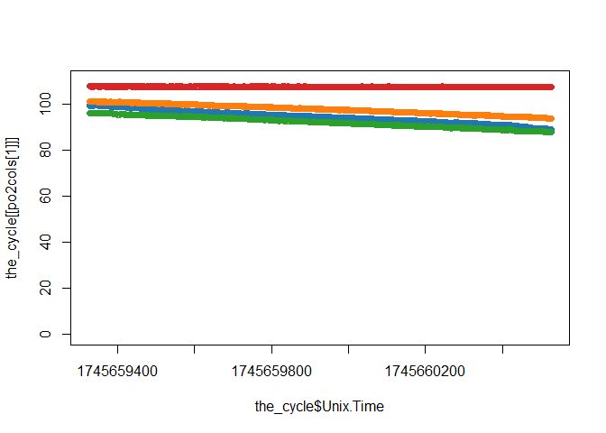

<!-- README.md is generated from README.Rmd. Please edit that file -->

# flatheadresp

<!-- badges: start -->
<!-- badges: end -->

The goal of flatheadresp is to streamline working with respirometry data
that is produced from the AquaResp software (i.e., used in the TAF lab
for flathead metabolic rate experiments), including importing AquaResp
metadata and experimental data files into R, correcting mass-specific
MO2 for post-experiment body mass measurements or other fixes, and
calculating MO_2 from the linear regression slope of raw O2 data and
correlation of O_2 ~ time. This allows calculating accurate coefficients
of determination (R^2) to overcome the bug in the AquaResp v3.0 version
where any missing O_2 values resulted in erroneous R^2 values for MO2
measurements

## Installation

You can install the development version of flatheadresp from
[GitHub](https://github.com/) with:

``` r
# install.packages("pak")
pak::pak("bwwolfe/flatheadresp")
```

## Example

``` r
library(flatheadresp)
library(tidyr)
library(ggplot2)
#> Warning: package 'ggplot2' was built under R version 4.5.1
library(cowplot)
library(ggthemes)
#> 
#> Attaching package: 'ggthemes'
#> The following object is masked from 'package:cowplot':
#> 
#>     theme_map
```

## Load Example Data

The package ships an example AquaResp experiment under
`inst/extdata/aquaresp_experiment` that is used in the examples in the
documentation. Use `system.file()` to locate it:

``` r
exp_dir_path <- system.file("extdata", "aquaresp_experiment",
                            package = "flatheadresp")
exp_dir_path
#> [1] "C:/Users/bwolfe/AppData/Local/Temp/RtmpMP7Chr/temp_libpath83f0db14c18/flatheadresp/extdata/aquaresp_experiment"
```

## Experimental Metadata and MO₂

Retrieve metadata for all chambers:

``` r
get_exp_metadata(exp_dir_path)
#>   chamber Experiment.start..UNIX.time Flush.time..s Wait.time..s
#> 1       1                  1745641134           240           60
#> 2       2                  1745641134           240           60
#> 3       3                  1745641134           240           60
#> 4       4                  1745641134           240           60
#>   Measurement.time..s Mass.of.fish..kg Volume.respirometer..L
#> 1                1200            0.123                   3.35
#> 2                1200            0.058                   3.35
#> 3                1200            0.127                   3.35
#> 4                1200            0.001                   3.35
#>   Real.volume..vresp...vfish...neutrally.bouyant...L Salinity Temperature
#> 1                                              3.227     35.5        15.6
#> 2                                              3.292     35.5        15.6
#> 3                                              3.223     35.5        15.6
#> 4                                              3.349     35.5        15.6
#>   Oxygen.solubilty..mg.O2...L           exp_start
#> 1                      8.0623 2025-04-26 14:18:54
#> 2                      8.0623 2025-04-26 14:18:54
#> 3                      8.0623 2025-04-26 14:18:54
#> 4                      8.0623 2025-04-26 14:18:54
```

Get AquaResp-calculated MO₂ for one chamber:

``` r
get_exp_MO2s(exp_dir_path, chamber = 2)
#>    chamber cycle          Clock.TIME TIME.HOURS  TIME.UNIX       MO2
#> 1        2     1 2025-04-26 16:02:07  0.3502778 1745648526  88.72929
#> 2        2     2 2025-04-26 16:27:07  0.7669444 1745650026 113.65878
#> 3        2     3 2025-04-26 16:52:07  1.1836111 1745651526 109.80107
#> 4        2     4 2025-04-26 17:17:07  1.6002778 1745653026 108.06524
#> 5        2     5 2025-04-26 17:42:07  2.0169444 1745654527  99.44971
#> 6        2     6 2025-04-26 18:07:07  2.4336111 1745656027  93.45417
#> 7        2     7 2025-04-26 18:32:07  2.8502778 1745657527  95.37645
#> 8        2     8 2025-04-26 18:57:07  3.2669444 1745659027  98.62787
#> 9        2     9 2025-04-26 19:22:07  3.6836111 1745660527 100.46148
#> 10       2    10 2025-04-26 19:47:07  4.1002778 1745662027 104.33585
#> 11       2    11 2025-04-26 20:12:07  4.5169444 1745663527  98.80043
#> 12       2    12 2025-04-26 20:37:07  4.9336111 1745665027  95.90009
#> 13       2    13 2025-04-26 21:02:07  5.3502778 1745666527  97.59521
#> 14       2    14 2025-04-26 21:27:07  5.7669444 1745668027  97.15890
#> 15       2    15 2025-04-26 21:52:07  6.1838889 1745669527  95.83035
#> 16       2    16 2025-04-26 22:17:08  6.6002778 1745671027  87.04947
#> 17       2    17 2025-04-26 22:42:07  7.0172222 1745672527  95.27548
#> 18       2    18 2025-04-26 23:07:08  7.4338889 1745674027  61.33239
#> 19       2    19 2025-04-26 23:32:08  7.8505556 1745675527  62.65676
#> 20       2    20 2025-04-26 23:57:08  8.2672222 1745677028  52.42297
#> 21       2    21 2025-04-27 00:22:08  8.6838889 1745678527  52.49394
#> 22       2    22 2025-04-27 00:47:08  9.1005556 1745680028  62.26568
#> 23       2    23 2025-04-27 01:12:08  9.5172222 1745681528  39.31957
#> 24       2    24 2025-04-27 01:37:08  9.9338889 1745683028  34.08870
#> 25       2    25 2025-04-27 02:02:08 10.3505556 1745684528  31.80987
#> 26       2    26 2025-04-27 02:27:08 10.7672222 1745686028  38.59863
#> 27       2    27 2025-04-27 02:52:08 11.1838889 1745687528  35.18475
#> 28       2    28 2025-04-27 03:17:08 11.6005556 1745689028  38.63968
#> 29       2    29 2025-04-27 03:42:09 12.0172222 1745690528  35.08911
#> 30       2    30 2025-04-27 04:07:08 12.4338889 1745692028  25.78993
#> 31       2    31 2025-04-27 04:32:08 12.8505556 1745693528  28.43535
#> 32       2    32 2025-04-27 04:57:08 13.2672222 1745695028  34.28777
#> 33       2    33 2025-04-27 05:22:09 13.6841667 1745696528  73.48449
#> 34       2    34 2025-04-27 05:47:09 14.1008333 1745698028  43.46695
#> 35       2    35 2025-04-27 06:12:09 14.5175000 1745699528  34.41527
#> 36       2    36 2025-04-27 06:37:09 14.9341667 1745701028  20.62431
#> 37       2    37 2025-04-27 07:02:09 15.3508333 1745702529  27.68284
#> 38       2    38 2025-04-27 07:27:09 15.7675000 1745704029  33.80478
#> 39       2    39 2025-04-27 07:52:09 16.1841667 1745705529  34.59333
#> 40       2    40 2025-04-27 08:17:09 16.6008333 1745707029  33.74995
#> 41       2    41 2025-04-27 08:42:09 17.0175000 1745708529  31.71990
#> 42       2    42 2025-04-27 09:07:09 17.4341667 1745710029  38.01527
#> 43       2    43 2025-04-27 09:32:09 17.8508333 1745711529  28.66114
#> 44       2    44 2025-04-27 09:57:09 18.2675000 1745713029  31.07699
#> 45       2    45 2025-04-27 10:22:09 18.6841667 1745714529  31.10454
#> 46       2    46 2025-04-27 10:47:09 19.1008333 1745716029  32.67201
#> 47       2    47 2025-04-27 11:12:09 19.5177778 1745717529  31.68990
#> 48       2    48 2025-04-27 11:37:10 19.9344444 1745719029  28.06865
#> 49       2    49 2025-04-27 12:02:10 20.3511111 1745720530  21.52371
#> 50       2    50 2025-04-27 12:27:10 20.7677778 1745722029  26.25336
#> 51       2    51 2025-04-27 12:52:10 21.1844444 1745723530  28.05069
#> 52       2    52 2025-04-27 13:17:10 21.6011111 1745725030  31.41871
#>           SLOPE Intercept  Pearson.R        R.2             P      Std.Err
#> 1  -0.005386100  101.8832 -0.9956077 0.99123464  0.000000e+00 1.463943e-05
#> 2  -0.006899386  103.9502 -0.6513065 0.42420021 1.177663e-145 2.323345e-04
#> 3  -0.006665212  102.9401 -0.9991329 0.99826648  0.000000e+00 8.024657e-06
#> 4  -0.006559843  102.3915 -0.9985404 0.99708300  0.000000e+00 1.025102e-05
#> 5  -0.006036858  101.0153 -0.9982962 0.99659540  0.000000e+00 1.019427e-05
#> 6  -0.005672913  100.4844 -0.9988779 0.99775699  0.000000e+00 7.771076e-06
#> 7  -0.005789600  100.9021 -0.9986696 0.99734105  0.000000e+00 8.636813e-06
#> 8  -0.005986970  101.1974 -0.9988855 0.99777216  0.000000e+00 8.173435e-06
#> 9  -0.006098275  101.3929 -0.9986885 0.99737875  0.000000e+00 9.032392e-06
#> 10 -0.006333459  101.6262 -0.9984779 0.99695808  0.000000e+00 1.010761e-05
#> 11 -0.005997445  100.6570 -0.9981792 0.99636181  0.000000e+00 1.047061e-05
#> 12 -0.005821386  100.4704 -0.5843490 0.34146372 8.404215e-111 2.335692e-04
#> 13 -0.005924285  101.3436 -0.9982385 0.99648017  0.000000e+00 1.017264e-05
#> 14 -0.005897799  101.5835 -0.9984012 0.99680505  0.000000e+00 9.646922e-06
#> 15 -0.005817153  101.8219 -0.9991003 0.99820142  0.000000e+00 7.134077e-06
#> 16 -0.005284131  102.1178 -0.9977782 0.99556141  0.000000e+00 1.019800e-05
#> 17 -0.005783471  100.9554 -0.9987439 0.99748944  0.000000e+00 8.379339e-06
#> 18 -0.003723037  101.2520 -0.9969648 0.99393885  0.000000e+00 8.399756e-06
#> 19 -0.003803429  102.0787 -0.9937285 0.98749632  0.000000e+00 1.236511e-05
#> 20 -0.003182211  102.0709 -0.9315698 0.86782237  3.594184e-76 9.553208e-05
#> 21 -0.003186520  102.5316 -0.9953689 0.99075927  0.000000e+00 8.891137e-06
#> 22 -0.003779690  102.7754 -0.4012498 0.16100143  1.231153e-47 2.492835e-04
#> 23 -0.002386801  101.5150 -0.2732823 0.07468321  5.365512e-22 2.427289e-04
#> 24 -0.002069273  101.3278 -0.9817709 0.96387414  0.000000e+00 1.157413e-05
#> 25 -0.001930942  102.1664 -0.9794409 0.95930446  0.000000e+00 1.149042e-05
#> 26 -0.002343038  102.8276 -0.2693875 0.07256962  2.134244e-21 2.419993e-04
#> 27 -0.002135806  103.1633 -0.9814037 0.96315323  0.000000e+00 1.206939e-05
#> 28 -0.002345530  103.3816 -0.9803136 0.96101471  0.000000e+00 1.364891e-05
#> 29 -0.002130001  102.2004 -0.9640502 0.92939279  0.000000e+00 1.696905e-05
#> 30 -0.001565516  101.8647 -0.1823151 0.03323878  1.986355e-10 2.439306e-04
#> 31 -0.001726100  102.5328 -0.9801871 0.96076669  0.000000e+00 1.007758e-05
#> 32 -0.002081357  102.9395 -0.9543893 0.91085892  0.000000e+00 1.881186e-05
#> 33 -0.004460701  102.9723 -0.9865894 0.97335873  0.000000e+00 2.132140e-05
#> 34 -0.002638558  102.9049 -0.9896825 0.97947151  0.000000e+00 1.103623e-05
#> 35 -0.002089097  102.1945 -0.9637613 0.92883575  0.000000e+00 1.670674e-05
#> 36 -0.001251950  101.6411 -0.1460375 0.02132694  3.756970e-07 2.450265e-04
#> 37 -0.001680421  102.7033 -0.9654275 0.93205031  0.000000e+00 1.310883e-05
#> 38 -0.002052038  103.1955 -0.9639236 0.92914877  0.000000e+00 1.637149e-05
#> 39 -0.002099906  103.3828 -0.9851982 0.97061554  0.000000e+00 1.055618e-05
#> 40 -0.002048710  103.5347 -0.9744920 0.94963473  0.000000e+00 1.363137e-05
#> 41 -0.001925481  102.5885 -0.9446724 0.89240603  0.000000e+00 1.931628e-05
#> 42 -0.002307626  102.6568 -0.2652485 0.07035678  9.031899e-21 2.423496e-04
#> 43 -0.001739806  103.0315 -0.9596796 0.92098498  0.000000e+00 1.472316e-05
#> 44 -0.001886455  103.3935 -0.9842655 0.96877853  0.000000e+00 9.784361e-06
#> 45 -0.001888127  103.7602 -0.9817441 0.96382144  0.000000e+00 1.056891e-05
#> 46 -0.001983276  103.7275 -0.9790267 0.95849327  0.000000e+00 1.192393e-05
#> 47 -0.001923660  103.0710 -0.9486039 0.89984931  0.000000e+00 1.854137e-05
#> 48 -0.001703840  102.4694 -0.9734869 0.94767682  0.000000e+00 1.156691e-05
#> 49 -0.001306545  102.6208 -0.9643637 0.92999739  0.000000e+00 1.035649e-05
#> 50 -0.001593647  103.2686 -0.9713670 0.94355382  0.000000e+00 1.126154e-05
#> 51 -0.001702750  103.5865 -0.9725443 0.94584235  0.000000e+00 1.177181e-05
#> 52 -0.001907198  103.8031 -0.9763353 0.95323060  0.000000e+00 1.220532e-05
#>    Measurement.duration.seconds   avg.po2 median.po2 minimum.po2 max.po2
#> 1                          1199  98.65157    98.8040      95.181 101.435
#> 2                          1199  99.81058    99.9280       0.000 103.549
#> 3                          1200  98.93762    99.0055      94.807 102.842
#> 4                          1200  98.45235    98.4890      94.276 102.205
#> 5                          1200  97.39020    97.4000      93.605 100.770
#> 6                          1200  97.07784    97.2040      93.540 100.267
#> 7                          1200  97.42546    97.5045      93.875 100.760
#> 8                          1200  97.60219    97.6930      93.730 101.006
#> 9                          1200  97.73089    97.8290      93.834 101.169
#> 10                         1200  97.82294    97.8715      93.757 101.374
#> 11                         1200  97.05554    97.2275      93.239 100.425
#> 12                         1200  96.97464    97.1160       0.000 100.447
#> 13                         1200  97.78611    97.8425      94.105 101.127
#> 14                         1200  98.04189    98.1450      94.202 101.402
#> 15                         1200  98.32868    98.3190      94.798 101.580
#> 16                         1199  98.94728    99.0370      95.397 101.895
#> 17                         1201  97.47957    97.3650      94.096 100.907
#> 18                         1200  99.01633    99.0640      96.526 101.164
#> 19                         1200  99.79470    99.9560      97.316 101.855
#> 20                         1200 101.79723   101.8040     101.446 102.165
#> 21                         1200 100.61808   100.6915      98.528 102.312
#> 22                         1200 100.50566   101.0440       0.000 102.527
#> 23                         1200 100.08171   100.3360       0.000 101.435
#> 24                         1200 100.08519   100.1750      98.563 101.178
#> 25                         1200 101.00683   101.1210      99.497 102.021
#> 26                         1200 101.42060   101.5780       0.000 102.592
#> 27                         1200 101.88071   101.9790     100.192 103.010
#> 28                         1200 101.97314   102.1210     100.287 103.139
#> 29                         1199 100.92241   101.1110      99.219 101.917
#> 30                         1200 100.92461   101.1310       0.000 101.887
#> 31                         1200 101.49630   101.5985     100.261 102.369
#> 32                         1200 101.68966   101.8490      99.615 102.696
#> 33                         1200 100.29365   100.5310      97.137 102.684
#> 34                         1200 101.32042   101.4365      99.509 102.718
#> 35                         1200 100.94001   101.1245      99.222 101.941
#> 36                         1200 100.88934   101.0870       0.000 101.829
#> 37                         1200 101.69422   101.8895     100.426 102.512
#> 38                         1200 101.96325   102.1780     100.283 102.902
#> 39                         1200 102.12184   102.1860     100.565 103.316
#> 40                         1200 102.30449   102.4810     100.729 103.349
#> 41                         1200 101.43225   101.6475      99.536 102.296
#> 42                         1200 101.27103   101.5380       0.000 102.266
#> 43                         1200 101.98677   102.1070     100.367 102.887
#> 44                         1200 102.26067   102.4165     100.933 103.240
#> 45                         1200 102.62639   102.7370     101.214 103.629
#> 46                         1200 102.53659   102.6750     101.045 103.516
#> 47                         1200 101.91587   102.1240     100.253 102.769
#> 48                         1200 101.44626   101.5770     100.207 102.324
#> 49                         1200 101.83627   101.9600     100.677 102.542
#> 50                         1200 102.31162   102.4300     101.066 103.097
#> 51                         1200 102.56399   102.6970     101.258 103.370
#> 52                         1200 102.65783   102.7665     100.965 103.537
#>    delta.po2 oxygen.solubility ratio.vreal.fish total.experiment.duration.hours
#> 1      6.254          8.062287         56.75862                       0.3502778
#> 2    103.549          8.062287         56.75862                       0.7669444
#> 3      8.035          8.062287         56.75862                       1.1836111
#> 4      7.929          8.062287         56.75862                       1.6002778
#> 5      7.165          8.062287         56.75862                       2.0169444
#> 6      6.727          8.062287         56.75862                       2.4336111
#> 7      6.885          8.062287         56.75862                       2.8502778
#> 8      7.276          8.062287         56.75862                       3.2669444
#> 9      7.335          8.062287         56.75862                       3.6836111
#> 10     7.617          8.062287         56.75862                       4.1002778
#> 11     7.186          8.062287         56.75862                       4.5169444
#> 12   100.447          8.062287         56.75862                       4.9336111
#> 13     7.022          8.062287         56.75862                       5.3502778
#> 14     7.200          8.062287         56.75862                       5.7669444
#> 15     6.782          8.062287         56.75862                       6.1838889
#> 16     6.498          8.062287         56.75862                       6.6002778
#> 17     6.811          8.062287         56.75862                       7.0172222
#> 18     4.638          8.062287         56.75862                       7.4338889
#> 19     4.539          8.062287         56.75862                       7.8505556
#> 20     0.719          8.062287         56.75862                       8.2672222
#> 21     3.784          8.062287         56.75862                       8.6838889
#> 22   102.527          8.062287         56.75862                       9.1005556
#> 23   101.435          8.062287         56.75862                       9.5172222
#> 24     2.615          8.062287         56.75862                       9.9338889
#> 25     2.524          8.062287         56.75862                      10.3505556
#> 26   102.592          8.062287         56.75862                      10.7672222
#> 27     2.818          8.062287         56.75862                      11.1838889
#> 28     2.852          8.062287         56.75862                      11.6005556
#> 29     2.698          8.062287         56.75862                      12.0172222
#> 30   101.887          8.062287         56.75862                      12.4338889
#> 31     2.108          8.062287         56.75862                      12.8505556
#> 32     3.081          8.062287         56.75862                      13.2672222
#> 33     5.547          8.062287         56.75862                      13.6841667
#> 34     3.209          8.062287         56.75862                      14.1008333
#> 35     2.719          8.062287         56.75862                      14.5175000
#> 36   101.829          8.062287         56.75862                      14.9341667
#> 37     2.086          8.062287         56.75862                      15.3508333
#> 38     2.619          8.062287         56.75862                      15.7675000
#> 39     2.751          8.062287         56.75862                      16.1841667
#> 40     2.620          8.062287         56.75862                      16.6008333
#> 41     2.760          8.062287         56.75862                      17.0175000
#> 42   102.266          8.062287         56.75862                      17.4341667
#> 43     2.520          8.062287         56.75862                      17.8508333
#> 44     2.307          8.062287         56.75862                      18.2675000
#> 45     2.415          8.062287         56.75862                      18.6841667
#> 46     2.471          8.062287         56.75862                      19.1008333
#> 47     2.516          8.062287         56.75862                      19.5177778
#> 48     2.117          8.062287         56.75862                      19.9344444
#> 49     1.865          8.062287         56.75862                      20.3511111
#> 50     2.031          8.062287         56.75862                      20.7677778
#> 51     2.112          8.062287         56.75862                      21.1844444
#> 52     2.572          8.062287         56.75862                      21.6011111
#>       minutes seconds       days
#> 1    21.01667    1261 0.01459491
#> 2    46.01667    2761 0.03195602
#> 3    71.01667    4261 0.04931713
#> 4    96.01667    5761 0.06667824
#> 5   121.01667    7261 0.08403935
#> 6   146.01667    8761 0.10140046
#> 7   171.01667   10261 0.11876157
#> 8   196.01667   11761 0.13612269
#> 9   221.01667   13261 0.15348380
#> 10  246.01667   14761 0.17084491
#> 11  271.01667   16261 0.18820602
#> 12  296.01667   17761 0.20556713
#> 13  321.01667   19261 0.22292824
#> 14  346.01667   20761 0.24028935
#> 15  371.03333   22262 0.25766204
#> 16  396.01667   23761 0.27501157
#> 17  421.03333   25262 0.29238426
#> 18  446.03333   26762 0.30974537
#> 19  471.03333   28262 0.32710648
#> 20  496.03333   29762 0.34446759
#> 21  521.03333   31262 0.36182870
#> 22  546.03333   32762 0.37918981
#> 23  571.03333   34262 0.39655093
#> 24  596.03333   35762 0.41391204
#> 25  621.03333   37262 0.43127315
#> 26  646.03333   38762 0.44863426
#> 27  671.03333   40262 0.46599537
#> 28  696.03333   41762 0.48335648
#> 29  721.03333   43262 0.50071759
#> 30  746.03333   44762 0.51807870
#> 31  771.03333   46262 0.53543981
#> 32  796.03333   47762 0.55280093
#> 33  821.05000   49263 0.57017361
#> 34  846.05000   50763 0.58753472
#> 35  871.05000   52263 0.60489583
#> 36  896.05000   53763 0.62225694
#> 37  921.05000   55263 0.63961806
#> 38  946.05000   56763 0.65697917
#> 39  971.05000   58263 0.67434028
#> 40  996.05000   59763 0.69170139
#> 41 1021.05000   61263 0.70906250
#> 42 1046.05000   62763 0.72642361
#> 43 1071.05000   64263 0.74378472
#> 44 1096.05000   65763 0.76114583
#> 45 1121.05000   67263 0.77850694
#> 46 1146.05000   68763 0.79586806
#> 47 1171.06667   70264 0.81324074
#> 48 1196.06667   71764 0.83060185
#> 49 1221.06667   73264 0.84796296
#> 50 1246.06667   74764 0.86532407
#> 51 1271.06667   76264 0.88268519
#> 52 1296.06667   77764 0.90004630
```

Or for all chambers:

``` r
mo2s <- get_exp_MO2s(exp_dir_path)
head(mo2s)
#>   chamber cycle          Clock.TIME TIME.HOURS  TIME.UNIX       MO2       SLOPE
#> 1       1     1 2025-04-26 16:02:07  0.3500000 1745648526 124.18925 -0.01630908
#> 2       1     2 2025-04-26 16:27:07  0.7666667 1745650026 132.90175 -0.01745324
#> 3       1     3 2025-04-26 16:52:07  1.1836111 1745651526 120.47219 -0.01582094
#> 4       1     4 2025-04-26 17:17:07  1.6002778 1745653026  98.28319 -0.01290698
#> 5       1     5 2025-04-26 17:42:07  2.0169444 1745654527  86.05319 -0.01130088
#> 6       1     6 2025-04-26 18:07:07  2.4336111 1745656027  86.67846 -0.01138300
#>   Intercept  Pearson.R       R.2 P      Std.Err Measurement.duration.seconds
#> 1  96.79758 -0.9992922 0.9985849 0 1.774512e-05                         1199
#> 2 100.40244 -0.9325148 0.8695838 0 1.953616e-04                         1199
#> 3 100.81802 -0.9979925 0.9959890 0 2.900686e-05                         1200
#> 4  99.59332 -0.9997433 0.9994866 0 8.451559e-06                         1200
#> 5  98.68149 -0.9984348 0.9968720 0 1.828944e-05                         1200
#> 6  98.08598 -0.9979846 0.9959732 0 2.091136e-05                         1200
#>    avg.po2 median.po2 minimum.po2 max.po2 delta.po2 oxygen.solubility
#> 1 87.01214    86.9360      77.252  96.350    19.098          8.062287
#> 2 89.93050    89.8390       0.000 100.297   100.297          8.062287
#> 3 91.31754    91.6375      81.106 100.020    18.914          8.062287
#> 4 91.84268    91.8945      84.023  99.411    15.388          8.062287
#> 5 91.89531    91.9490      84.533  98.627    14.094          8.062287
#> 6 91.25049    90.9930      84.784  98.230    13.446          8.062287
#>   ratio.vreal.fish total.experiment.duration.hours   minutes seconds       days
#> 1         26.23577                       0.3500000  21.00000    1260 0.01458333
#> 2         26.23577                       0.7666667  46.00000    2760 0.03194444
#> 3         26.23577                       1.1836111  71.01667    4261 0.04931713
#> 4         26.23577                       1.6002778  96.01667    5761 0.06667824
#> 5         26.23577                       2.0169444 121.01667    7261 0.08403935
#> 6         26.23577                       2.4336111 146.01667    8761 0.10140046
```

Correct MO₂ if a fish mass was entered incorrectly:

``` r
fix_exp_MO2s(exp_dir_path, chamber = 1, new_mass = 0.200)
#> 
#>   fish mass: 0.123 -> 0.2
#>   resp real volume: 3.227 -> 3.15
#>  [1] 74.55396 79.78429 72.32251 59.00189 51.65991 52.03528 62.00504 50.28112
#>  [9] 35.89448 39.97915 27.75402 35.65971 42.40138 49.13205 31.37980 21.81847
#> [17] 32.69161 23.27258 24.79018 21.75080 25.66002 18.47802 33.50306 28.54251
#> [25] 19.11544 20.62882 22.61734 19.81893 18.56297 13.29642 13.73871 12.90542
#> [33] 13.38669 14.24745 13.58811 10.61660 11.93343 11.66985 16.67020 13.97763
#> [41] 13.13638 12.51221 12.00444 13.82982 17.37329 13.44474 12.39926 12.26042
#> [49] 10.26203 11.21718 12.16745 17.42396
```

## Cycle-Level Data

Read a single cycle file:

``` r
cycle <- read_cycle(cycle_number = 9, path = exp_dir_path)
head(cycle)
#>                  Time Seconds.from.start.for.linreg  Unix.Time ch1.po2 ch2.po2
#> 1 1900-01-01 19:22:07                             1 1745659327  99.521 101.103
#> 2 1900-01-01 19:22:08                             2 1745659328  99.349 101.169
#> 3 1900-01-01 19:22:09                             3 1745659329  99.342 101.169
#> 4 1900-01-01 19:22:10                             4 1745659330  99.342 101.020
#> 5 1900-01-01 19:22:11                             5 1745659331  99.291 101.035
#> 6 1900-01-01 19:22:12                             6 1745659332  99.352 101.035
#>   ch3.po2 ch4.po2
#> 1  96.265 107.683
#> 2  96.213 107.731
#> 3  96.213 107.731
#> 4  96.184 107.663
#> 5  96.169 107.663
#> 6  96.169 107.709
```

Convert to long format for plotting:

``` r
cycle_long <- cycle %>%
  pivot_longer(cols = starts_with("ch"),
               names_to = "chamber",
               names_pattern = "ch(\\d)\\.po2",
               values_to = "po2")
```

Plot PO₂ over time:

``` r
ggplot(cycle_long |> subset(po2 > 0),
       aes(Unix.Time - min(Unix.Time), po2, colour = chamber)) +
  geom_path() +
  scale_colour_tableau("Tableau 10") +
  theme_cowplot(12)
```



## MO₂ Trends Over Time

Visualize MO₂ across cycles:

``` r
mo2s <- transform(mo2s, chamber = factor(chamber))

ggplot(mo2s |> subset(chamber != 5),
       aes(x = TIME.HOURS, y = MO2 / 100,
           colour = chamber, shape = chamber)) +
  geom_path(linewidth = 0.3) +
  geom_point(size = 2.5) +
  scale_colour_tableau("Tableau 10") +
  theme_cowplot(12) +
  scale_x_continuous("Hours since start", expand = c(0.03, 0), n.breaks = 20) +
  scale_y_continuous("Mass-specific MO₂")
```


## Cycle Summary

Summarize PO₂ ranges and correlations:

``` r
cyc_summary <- get_exp_cycle_summary(exp_dir_path)
head(cyc_summary)
#>   ch1.po2.min ch1.po2.max ch2.po2.min ch2.po2.max ch3.po2.min ch3.po2.max
#> 1      77.252      96.350      95.181     101.435      99.780     100.747
#> 2      79.793     100.297      95.840     103.549      98.824      99.369
#> 3      81.106     100.020      94.807     102.842      98.279      98.649
#> 4      84.023      99.411      94.276     102.205      97.145      98.120
#> 5      84.533      98.627      93.605     100.770    -300.000      97.134
#> 6      84.784      98.230      93.540     100.267      82.384      95.269
#>   ch4.po2.min ch4.po2.max ch1.po2.r2.cor ch2.po2.r2.cor ch3.po2.r2.cor
#> 1     108.902     112.238     -0.9992926     -0.9956057    -0.93376771
#> 2     112.512     113.433     -0.9994578     -0.9988078    -0.66357237
#> 3     112.880     113.417     -0.9979935     -0.9991333    -0.05008843
#> 4     112.111     113.039     -0.9997434     -0.9985394    -0.96263344
#> 5     110.472     112.017     -0.9984351     -0.9982961    -0.06137785
#> 6     108.975     110.205     -0.9979847     -0.9988777    -0.99367123
#>   ch4.po2.r2.cor ch1.po2.r2.pval ch2.po2.r2.pval ch3.po2.r2.pval
#> 1      0.9910560               0               0         0.00000
#> 2      0.9355629               0               0         0.00000
#> 3     -0.8535382               0               0         0.08285
#> 4     -0.9391888               0               0         0.00000
#> 5     -0.9904263               0               0         0.03350
#> 6     -0.9856225               0               0         0.00000
#>   ch4.po2.r2.pval ch1.po2.pct0 ch2.po2.pct0 ch3.po2.pct0 ch4.po2.pct0
#> 1               0         0.00         0.00         0.00         0.00
#> 2               0         0.08         0.08         0.08         0.08
#> 3               0         0.00         0.00         0.00         0.00
#> 4               0         0.00         0.00         0.00         0.00
#> 5               0         0.00         0.00         0.00         0.00
#> 6               0         0.00         0.00         0.00         0.00
```

Plot PO₂ min/max per cycle:

``` r
cyc_po2_range <- cyc_summary[, 1:8]
cyc_po2_range$cycle <- 1:nrow(cyc_po2_range)

cyc_po2_long <- cyc_po2_range %>%
  pivot_longer(cols = -cycle,
               names_to = c("chamber", "po2type"),
               names_pattern = "ch(\\d+)\\.po2\\.(min|max)",
               values_to = "po2") %>%
  pivot_wider(names_from = po2type, values_from = po2)

ggplot(cyc_po2_long |> subset(chamber != "000"),
       aes(x = cycle, colour = chamber)) +
  geom_segment(aes(y = min, yend = max),
               position = position_dodge2(width = .6),
               linewidth = 0.8) +
  scale_colour_tableau("Classic 10") +
  theme_cowplot(12) +
  scale_x_continuous(breaks = 1:max(cyc_po2_long$cycle)) +
  scale_y_continuous(bquote('pO[2] range during cycle (% O[2] sat)'))
```


## Estimating SMR

Example: compute 20th percentile MO₂ for resting period:

``` r
resting_mo2s <- mo2s[mo2s$TIME.HOURS >= 10,]

SMR_q20 <- sapply(1:3, \(x) {
  data <- subset(resting_mo2s, chamber == x)
  quantile(data$MO2[data$R.2 >= 0.96], 0.2)
})
SMR_q20
#>      20%      20%      20% 
#> 20.08184 31.08801 34.45790
```

## Next Steps

- Explore `plot_cycle_po2()` for quick cycle plots.
- Use `fix_exp_MO2s()` for correcting metadata errors.
- Combine summaries for multi-experiment comparisons.

You’ll still need to render `README.Rmd` regularly, to keep `README.md`
up-to-date. `devtools::build_readme()` is handy for this.

You can also embed plots, for example:


In that case, don’t forget to commit and push the resulting figure
files, so they display on GitHub and CRAN.
