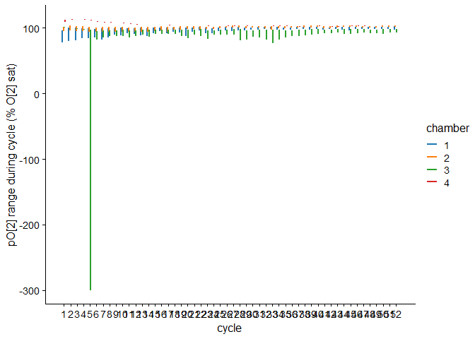

<!-- README.md is generated from README.Rmd. Please edit that file -->

# flatheadresp

<!-- badges: start -->
<!-- badges: end -->

The goal of flatheadresp is to streamline working with respirometry data
that is produced from the AquaResp software (i.e., used in the IMAS
Taroona Aquaculture Facility lab for flathead metabolic rate
experiments), including importing AquaResp metadata and experimental
data files into R, correcting mass-specific $\dot M O_2$ for
post-experiment body mass measurements or other fixes, and calculating
$\dot M O_2$ from the linear regression slope of raw O2 data and
correlation of O<sub>2</sub> ~ time.

AquaResp provide mass-specific oxygen consumption ($\dot M O_2$)
estimates for animals from oxygen concentration in each experimental
chamber during the sealed measurement portion of each flush-wait-measure
cycle. $\dot M O_2$ is provided in units of mg O₂/kg/hr (milligrams of
oxygen per kilogram of fish bodyweight per hour). $\dot M O_2$ are
calculated from the slope of a regression line fit to (declining) oxygen
concentration within the sealed chamber over time. Oxygen concentration
is sampled from the probe in the experimental chamber every second. As
is standard for respirometry work, $\dot M O_2$ estimates are quality
controlled with the coefficients of determination ($R^2$) calculated
with Pearson’s correlation, with $\dot M O_2$ values of $R^2 \geq 0.95$
considered precise enough. However, there is a bug in AquaResp where
occasionally, an O<sub>2</sub> concentration measurement is missed and
recorded as a 0 instead of NA, and then this causes an erroneously low
$R^2$ (Another source of error in this calculation is the Firesting
probes used in the IMAS TAF lab also sometimes register a -300 for PO2
if the optical probe is removed from its housing). This bug will also
create a slightly smaller magnitude slope and thus $\dot M O_2$ estimate
as well.

The functionality in this package allows for calculating accurate $R^2$
to overcome the bug in the AquaResp v3.0 version where any missing
O<sub>2</sub> values resulted in erroneous $R^2$ values for MO2
measurements. Doing this manually requires opening each measurement
cycle’s file (sometimes hundreds, e.g. SDA experiments) and
hand-calculating MO2 values.

Another useful function will allow animal masses and densities to be
corrected (AquaResp assume 1 kg/L which would be neutral buoyancy in
freshwater and slightly positively buoyant in saltwater, however benthic
Sand Flathead are around 1.1 kg/L).

`flatheadresp` also provides tools for monitoring experiments in
real-time.

## Installation

You can install the development version of flatheadresp from
[GitHub](https://github.com/) with:

``` r
# install.packages("pak")
pak::pak("bwwolfe/flatheadresp")
```

## How to use

``` r
library(flatheadresp)
```

### Load Example Data

The package ships an example AquaResp experiment under
`inst/extdata/aquaresp_experiment` that is used in the examples in the
documentation. Use `system.file()` to locate it.

``` r
exp_path <- system.file("extdata", "aquaresp_experiment",
                            package = "flatheadresp")
```

The good news is you only need to provide the file path of the
experiment you want to analyse as the `path =` argument, and the
package’s functions will extract the needed files. Here, we’ve saved the
experiment folder path as `exp_path`, and we can provide this to
functions for analysis. If you want to see where the files are saved and
browse them yourself, you can see the directory path with
`print(exp_path)` or just type `exp_path` into the console.

This demo experiment’s directory is structured in the standard format
used by AquaResp and this structure and file naming convention will be
expected by the functions in this package:

``` r
list.files(exp_path)
#>  [1] "All slopes"                  "Experimental information"   
#>  [3] "notes.txt"                   "Oxygen data raw"            
#>  [5] "Summary data ABS resp 1.txt" "Summary data ABS resp 2.txt"
#>  [7] "Summary data ABS resp 3.txt" "Summary data ABS resp 4.txt"
#>  [9] "Summary data resp 1.txt"     "Summary data resp 2.txt"    
#> [11] "Summary data resp 3.txt"     "Summary data resp 4.txt"
```

This should be how AquaResp has automatically saved the experimental
data, if e.g. you have four chambers, but worth noting if there are any
differences in the naming conventions or if folders are renamed, it
probably won’t work (also, there is usually an “Experimental
Information” folder created which was excluded with the example
experiment because it was empty). Herein *‘experiment’* will refer to
that which is recorded in the `exp_path`.

### Getting started

A good starting point is the function `summarise_experiment()`, which
will provide an easy to read summary of the experiment:

``` r
summarise_experiment(exp_path)
#> 
#> ── Experiment Summary ──
#> 
#> Started: 2025-04-26 14:18:54
#> Number of chambers: 4
#> 
#> ── Environmental Conditions
#> Salinity: 35.5 ppt
#> Temperature: 15.6 deg C
#> 
#> ── Fish Mass by Chamber
#> Chamber 1: 0.123 kg
#> Chamber 2: 0.058 kg
#> Chamber 3: 0.127 kg
#> Chamber 4: 0.001 kg
#> 
#> ── Respirometer Volumes
#> All chambers: 3.35 L
#> 
#> ── Cycle Timing
#> Flush: 240 s
#> Wait: 60 s
#> Measurement: 1200 s
#> 52 total cycles.
```

Here we can see there were three fish (Sand Flathead, *Platycephalus
bassensis*) were ran with masses from 58 g to 127 g, and Chamber 4 (ran
as a blank to measure background respiration), had an arbitrary 0.001 kg
mass entered.

To see all of the metadata for all chambers that AquaResp has stored,
get_exp_metadata will provide it collated into a dataframe:

``` r
get_exp_metadata(exp_path)
#>   chamber Experiment.start..UNIX.time Flush.time..s Wait.time..s
#> 1       1                  1745641134           240           60
#> 2       2                  1745641134           240           60
#> 3       3                  1745641134           240           60
#> 4       4                  1745641134           240           60
#>   Measurement.time..s Mass.of.fish..kg Volume.respirometer..L
#> 1                1200            0.123                   3.35
#> 2                1200            0.058                   3.35
#> 3                1200            0.127                   3.35
#> 4                1200            0.001                   3.35
#>   Real.volume..vresp...vfish...neutrally.bouyant...L Salinity Temperature
#> 1                                              3.227     35.5        15.6
#> 2                                              3.292     35.5        15.6
#> 3                                              3.223     35.5        15.6
#> 4                                              3.349     35.5        15.6
#>   Oxygen.solubilty..mg.O2...L           exp_start
#> 1                      8.0623 2025-04-26 14:18:54
#> 2                      8.0623 2025-04-26 14:18:54
#> 3                      8.0623 2025-04-26 14:18:54
#> 4                      8.0623 2025-04-26 14:18:54
```

### Load original, uncorrected AquaResp data with `get_exp_mo2s()`

To get the experimental MO_2 data that AquaResp recorded/calculated, use
the function `get_exp_mo2s()`, which returns it as a dataframe collated
for all chambers and cycles. No corrections are applied at this point.
There is `chambers` argument which will allow for subsetting by chamber,
e.g. to exclude the blank respirometer chamber 4 (here just the first
few rows are shown):

``` r

get_exp_mo2s(exp_path, chambers = c(1,2,3)) # or chamber = -4
```

    #>     cycle chamber          Clock.TIME TIME.HOURS  TIME.UNIX        MO2
    #> 1       1       1 2025-04-26 16:02:07  0.3500000 1745648526 124.189246
    #> 53      1       2 2025-04-26 16:02:07  0.3502778 1745648526  88.729289
    #> 105     1       3 2025-04-26 16:02:07  0.3502778 1745648526   4.523504
    #> 2       2       1 2025-04-26 16:27:07  0.7666667 1745650026 132.901748
    #>             SLOPE Intercept  Pearson.R       R.2 P      Std.Err
    #> 1   -0.0163090768  96.79758 -0.9992922 0.9985849 0 1.774512e-05
    #> 53  -0.0053861000 101.88323 -0.9956077 0.9912346 0 1.463943e-05
    #> 105 -0.0006141263 100.63985 -0.9337680 0.8719226 0 6.803116e-06
    #> 2   -0.0174532408 100.40244 -0.9325148 0.8695838 0 1.953616e-04
    #>     Measurement.duration.seconds   avg.po2 median.po2 minimum.po2 max.po2
    #> 1                           1199  87.01214     86.936      77.252  96.350
    #> 53                          1199  98.65157     98.804      95.181 101.435
    #> 105                         1199 100.27138    100.256      99.780 100.747
    #> 2                           1199  89.93050     89.839       0.000 100.297
    #>     delta.po2 oxygen.solubility ratio.vreal.fish
    #> 1      19.098          8.062287         26.23577
    #> 53      6.254          8.062287         56.75862
    #> 105     0.967          8.062287         25.37795
    #> 2     100.297          8.062287         26.23577
    #>     total.experiment.duration.hours  minutes seconds       days
    #> 1                         0.3500000 21.00000    1260 0.01458333
    #> 53                        0.3502778 21.01667    1261 0.01459491
    #> 105                       0.3502778 21.01667    1261 0.01459491
    #> 2                         0.7666667 46.00000    2760 0.03194444

## Recalculate experimental MO_2s with `calc_exp_mo2s()`

Generally speaking, however, you will want to use the main workhorse
function of `flatheadresp`, `calc_exp_mo2s()`. This function
recalculates all of the MO2 and related regression and correlation stats
after removing spurious missing PO2 values from the data, and also fixes
an AquaResp bug that results in spurious MO2 calculations for any
measurements that span midnight on the computer clock time. The function
will also return the original AquaResp data, with `_uncorrected`
appended to their names.

``` r

mo2_data <- calc_exp_mo2s(exp_path, chambers = -4)
#> 
#> ── MO2 Summary for selected chambers: 1, 2, 3 ──
#> 
#> With a po2 and r2 difference tolerance of 0.001:
#> • 52  cycle(s) total.
#> • 10  cycle(s) had corrected values.
#> • 9   cycle(s) had an uncorrected minimum.po2 <= 0.
#> • 1   cycle(s) had an uncorrected minimum.po2 < 0.
#> • 9   cycle(s) R^2 were corrected (changed > 0.001).
#> 
#> Max percent of pO2 measurements missing (<= 0) in a cycle: 1.00%
#> 
#> 0 cycle(s) in which all selected chambers' corrected R.2 < 0.95.
#> 
#> Cycles with corrected R.2 < 0.95 by chamber:
#> Chamber 1: 7 cycle(s) (18, 19, 20, 23, 27, 39, 45)
#> Chamber 2: 16 cycle(s) (22, 29, 30, 32, 35, 37, 38, 40, 41, 42 ...)
#> Chamber 3: 8 cycle(s) (1, 2, 3, 4, 5, 19, 22, 50)
```

`calc_exp_mo2s()` provides a summary of corrections and some metrics
that are useful to flag data quality issues. Details about these metrics
and their use can be found in the `?calc_exp_mo2s` documentation Details
section.

The function itself returns all of the original columns that AquaResp
saves to file and `get_exp_mo2s()` returns, however the recalculated
values take the place in the first few columns, followed by the original
values which are at the end of the dataframe’s columns:

``` r
head(mo2_data, n = 1)
#>   cycle chamber          Clock.TIME TIME.HOURS  TIME.UNIX    MO2       SLOPE
#> 1     1       1 2025-04-26 16:02:07       0.35 1745648526 124.19 -0.01630915
#>   Intercept  Pearson.R       R.2 P      Std.Err Measurement.duration.seconds
#> 1  96.78197 -0.9992926 0.9985857 0 1.774011e-05                         1199
#>    avg.po2 median.po2 minimum.po2 max.po2 delta.po2 oxygen.solubility
#> 1 87.01214     86.936      77.252   96.35    19.098          8.062287
#>   ratio.vreal.fish total.experiment.duration.hours minutes seconds       days
#> 1         26.23577                            0.35      21    1260 0.01458333
#>   pct0 corrected MO2_uncorrected SLOPE_uncorrected Intercept_uncorrected
#> 1    0     FALSE        124.1892       -0.01630908              96.79758
#>   Pearson.R_uncorrected R.2_uncorrected P_uncorrected Std.Err_uncorrected
#> 1            -0.9992922       0.9985849             0        1.774512e-05
#>   avg.po2_uncorrected median.po2_uncorrected minimum.po2_uncorrected
#> 1            87.01214                 86.936                  77.252
#>   max.po2_uncorrected delta.po2_uncorrected Mass_kg
#> 1               96.35                19.098   0.123
```

## Updating animal masses and/or densities with `fix_exp_mo2s()`

Sometimes an animal mass is incorrectly entered for an experiment and
needs to be updated. However, this is not as simple as multiplying the
mass-specific MO_2 by the original mass and re-dividing by the new mass,
as the animal mass is also used by AquaResp to calculate the real volume
of the respirometer (assuming neutral buoyancy of the animal in
freshwater e.g. 1 kg of fish = 1 L volume). The `fix_exp_mo2s()`
function will take new masses (in kg) for one or more of the
experiment’s chambers and perform this recalculation.

Also, the implicitly assumed density that AquaResp uses (1 kg/L) would
probably be a safe assumption for freshwater animals that are neutrally
buoyant, but is already slightly off for neutral buoyancy in seawater
(~1.025 kg/L), and will also be incorrect for benthic species that sink.
For example, Sand Flathead are (based on a few tests by the author)
about 1.1 kg/L. So the `fix_exp_mo2()` function allows for both masses
and densities to be updated and will correct the values accordingly.

For example, let’s say after the experiment it was found the 2nd and 3rd
chambers’ masses were accidentally swapped when entered into AquaResp
and need to be swapped back:

``` r

invisible(
  fix_exp_mo2s(path = exp_path,
  new_masses = c(`2` = 0.127, `3` = 0.058)) # name each new mass with the chamber number
  )                                         # in backticks or use NA for chambers that
#> 
#> ── Applying MO2 corrections per chamber ──
#> 
#> Chamber 1: 0.123 kg -> not changed
#> Respirometer ratio (rRespFish): 26.24 -> 26.24 L/kg
#> Mean MO2 % difference: 0%
#> 
#> Chamber 2: 0.058 kg -> 0.1270 kg
#> Respirometer ratio (rRespFish): 56.76 -> 25.38 L/kg
#> Mean MO2 % difference: -55.29%
#> 
#> Chamber 3: 0.127 kg -> 0.0580 kg
#> Respirometer ratio (rRespFish): 25.38 -> 56.76 L/kg
#> Mean MO2 % difference: 123.65%
#> 
#> Chamber 4: 0.001 kg -> not changed
#> Respirometer ratio (rRespFish): 3349 -> 3349 L/kg
#> Mean MO2 % difference: 0%
                                            # don't need to be updated
                                            # i.e. this works the same: c(NA, 0.127, 0.058, NA)
```

Or, we can update all of the chambers’ values with the appropriate
density for the species (the blank chamber 4 mass is changed to 0.1 kg
as well for illustration):

``` r
fixed_mo2s <-
  fix_exp_mo2s(path = exp_path,
               new_masses = c(`4` = 0.1), #single named value in vector - only applies to that chamber
               new_densities = 1.1) #if only scalar value is provided, it is applied to all chambers 
#> 
#> ── Applying MO2 corrections per chamber ──
#> 
#> Chamber 1: 0.123 kg -> not changed
#> Respirometer ratio (rRespFish): 26.24 -> 26.33 L/kg
#> Density: original = 1.000 kg/L, new = 1.100 kg/L
#> Mean MO2 % difference: 0.35%
#> 
#> Chamber 2: 0.058 kg -> not changed
#> Respirometer ratio (rRespFish): 56.76 -> 56.85 L/kg
#> Density: original = 1.000 kg/L, new = 1.100 kg/L
#> Mean MO2 % difference: 0.16%
#> 
#> Chamber 3: 0.127 kg -> not changed
#> Respirometer ratio (rRespFish): 25.38 -> 25.47 L/kg
#> Density: original = 1.000 kg/L, new = 1.100 kg/L
#> Mean MO2 % difference: 0.36%
#> 
#> Chamber 4: 0.001 kg -> 0.1000 kg
#> Respirometer ratio (rRespFish): 3349 -> 32.59 L/kg
#> Density: original = 1.000 kg/L, new = 1.100 kg/L
#> Mean MO2 % difference: -99.03%
```

As you can see, the result of including an appropriate density value
varies with the mass of the animal, so it could be an important thing to
correct for if the species is much different from the default 1 kg/L.
Both mass and density can be updated simultaneously.

Note in the below output of `fix_exp_mo2s()` with most of the columns
omitted for brevity — the **fixed** MO2 is now in the `MO2` column,
while the original value returned by `calc_exp_mo2s()` is retained but
renamed `MO2_orig`. Also, new columns for the original and new mass and
density (if applicable) are appended at the end of the columns.

``` r
head(fixed_mo2s[,c(1,2,6,7,40:43)], n = 5)
#>     cycle chamber        MO2    MO2_orig Mass_old Mass_kg Density_orig
#> 1       1       1 124.620356   124.19003    0.123   0.123            1
#> 53      1       2  88.871749    88.72963    0.058   0.058            1
#> 105     1       3   4.539734     4.52353    0.127   0.127            1
#> 157     1       4 -25.554630 -2625.96096    0.001   0.100            1
#> 2       2       1 131.060852   130.60828    0.123   0.123            1
#>     Density_new
#> 1           1.1
#> 53          1.1
#> 105         1.1
#> 157         1.1
#> 2           1.1
```

### Allometric Correction of Metabolic Rate

When comparing metabolic rates across organisms of different sizes, it
is common to apply an allometric correction to account for body mass
effects. Put simply, mass-specific metabolic rates of animals tend to
decrease as they increase in mass (both intra- and interspecifically).
In other words, an animal that grows twice as large does not typically
have twice as great of a metabolic rate, but usually slightly less than
that. The general relationship between metabolic rate and body mass
follows:

$$
\mathrm{MO}_2 \propto M^b
$$

where:

- $\mathrm{MO}_2$ = metabolic rate  

- $M$ = body mass (kg)  

- ## $b$ = allometric scaling exponent (commonly $b \approx 0.79$ for teleost fish (Clarke and Johnston 1999), in lieu of a species-specific value

To normalize to a scaling exponent $b$, multiply by $M^{1 - b}$:

$$
\mathrm{MO}_{2,b} = \mathrm{MO}_2 \times M^{(1 - b)}
$$

This converts units from:

$$
\mathrm{mg\ O_2}\cdot \mathrm{h}^{-1}\cdot \mathrm{kg}^{-1}
\quad \text{to} \quad
\mathrm{mg\ O_2}\cdot \mathrm{h}^{-1}\cdot \mathrm{kg}^{-b}
$$

The function `allometric_correct()` will do this, given the output from
`calc_exp_mo2s()` or `fix_exp_mo2s()`, or any dataframe with columns for
`Mass_kg` and `MO2`:

``` r

calc_exp_mo2s(path = exp_path,
              chambers = -4) |>
  fix_exp_mo2s(metadata =
                 get_exp_metadata(path = exp_path),
               new_densities = 1.1) |>
  allometric_correct(b = 0.79) |>
  (\(x) head(x[,c(1,2,3,6,7,41)],n=5))() #this just to limit output to a few example values
#> 
#> ── MO2 Summary for selected chambers: 1, 2, 3 ──
#> 
#> With a po2 and r2 difference tolerance of 0.001:
#> • 52  cycle(s) total.
#> • 10  cycle(s) had corrected values.
#> • 9   cycle(s) had an uncorrected minimum.po2 <= 0.
#> • 1   cycle(s) had an uncorrected minimum.po2 < 0.
#> • 9   cycle(s) R^2 were corrected (changed > 0.001).
#> 
#> Max percent of pO2 measurements missing (<= 0) in a cycle: 1.00%
#> 
#> 0 cycle(s) in which all selected chambers' corrected R.2 < 0.95.
#> 
#> Cycles with corrected R.2 < 0.95 by chamber:
#> Chamber 1: 7 cycle(s) (18, 19, 20, 23, 27, 39, 45)
#> Chamber 2: 16 cycle(s) (22, 29, 30, 32, 35, 37, 38, 40, 41, 42 ...)
#> Chamber 3: 8 cycle(s) (1, 2, 3, 4, 5, 19, 22, 50)
#> Warning: Number of chambers differ: 4 in metadata vs 3 in mo2_data.
#> 
#> ── Applying MO2 corrections per chamber ──
#> 
#> Chamber 1: 0.123 kg -> not changed
#> Respirometer ratio (rRespFish): 26.24 -> 26.33 L/kg
#> Density: original = 1.000 kg/L, new = 1.100 kg/L
#> Mean MO2 % difference: 0.35%
#> 
#> Chamber 2: 0.058 kg -> not changed
#> Respirometer ratio (rRespFish): 56.76 -> 56.85 L/kg
#> Density: original = 1.000 kg/L, new = 1.100 kg/L
#> Mean MO2 % difference: 0.16%
#> 
#> Chamber 3: 0.127 kg -> not changed
#> Respirometer ratio (rRespFish): 25.38 -> 25.47 L/kg
#> Density: original = 1.000 kg/L, new = 1.100 kg/L
#> Mean MO2 % difference: 0.36%
#> Warning: No rows found for chamber 4 in mo2_data. Skipping.
#>     cycle chamber          Clock.TIME        MO2  MO2_0.79 Mass_kg
#> 1       1       1 2025-04-26 16:02:07 124.620356 80.254439   0.123
#> 53      1       2 2025-04-26 16:02:07  88.871749 48.874644   0.058
#> 105     1       3 2025-04-26 16:02:07   4.539734  2.943264   0.127
#> 2       2       1 2025-04-26 16:27:07 131.060852 84.402063   0.123
#> 54      2       2 2025-04-26 16:27:07 107.923641 59.352151   0.058
```

## Monitoring and plotting

Sometimes for diagnosing issues, it is useful to plot the raw oxygen
measurements across a cycle’s measurement window:

``` r
plot_cycle_po2(cycle_number = 9, path = exp_path)
```



Alternatively, you can read in a single cycle’s data with `read_cycle()`
and plot with ggplot2. Convert to long format for plotting:

``` r
library(tidyr)

cycle9 <- read_cycle(cycle_number = 9, path = exp_path) 

cycle_long <- cycle9 %>%
  tidyr::pivot_longer(cols = starts_with("ch"),
               names_to = "chamber",
               names_pattern = "ch(\\d)\\.po2",
               values_to = "po2")
```

Plot partial pressure of oxygen (PO<sub>2</sub>) in the chambers during
the cycle:

``` r
library(ggplot2)
#> Warning: package 'ggplot2' was built under R version 4.5.1
ggplot(cycle_long,
       aes(Unix.Time - min(Unix.Time), po2, colour = chamber)) +
  geom_path() +
  scale_colour_brewer(palette = "Dark2") +
  theme_classic(9)
```


### Plotting MO<sub>2</sub> over time

Visualize MO<sub>2</sub> across cycles with `plot_exp()`:

``` r

plot_exp(path = exp_path, chambers = -4) #chamber 4 (blank) omitted
#> Warning: Using `size` aesthetic for lines was deprecated in ggplot2 3.4.0.
#> ℹ Please use `linewidth` instead.
#> ℹ The deprecated feature was likely used in the flatheadresp package.
#>   Please report the issue at <https://github.com/bwwolfe/flatheadresp/issues>.
#> This warning is displayed once every 8 hours.
#> Call `lifecycle::last_lifecycle_warnings()` to see where this warning was
#> generated.
```


The setting `show_cycle_labels = FALSE` will remove the cycle number
labels if they are getting too busy. Note that the output is a ggplot,
and so can be customised further by adding ggplot2 layers to it,
e.g. theme() to change theme elements.

For quick quality control checks and monitoring ongoing experiments, the
`print_exp_mo2s()` function will provide an overview of both MO2 values
and R^2s.

``` r

print_exp_mo2s(exp_path)
```

<figure>

<figcaption aria-hidden="true">example output from print_exp_mo2s() -
colour formatting doesn’t show up in the regular code output of the
github readme</figcaption>
</figure>

<!-- ## Cycle Summary -->
<!-- Plot PO₂ min/max per cycle: -->
<!-- ```{r, fig.width = 8} -->
<!-- mo2_data <- calc_exp_mo2s(path = exp_path, report = FALSE) -->
<!-- ggplot(mo2_data, -->
<!--        aes(x = cycle, colour = as.factor(chamber))) + -->
<!--   geom_segment(aes(y = minimum.po2, yend = max.po2), -->
<!--                position = position_dodge2(width = .6), -->
<!--                linewidth = 0.8) + -->
<!--   theme_classic(16) + -->
<!--   scale_colour_brewer("Chamber", palette = "Dark2")+ -->
<!--   scale_y_continuous(expression(p*O[2]~"range during cycle"~`(`*'%'~O[2]~"sat"*`)`)) + -->
<!--   labs(x = "Cycle #") -->
<!-- ``` -->
